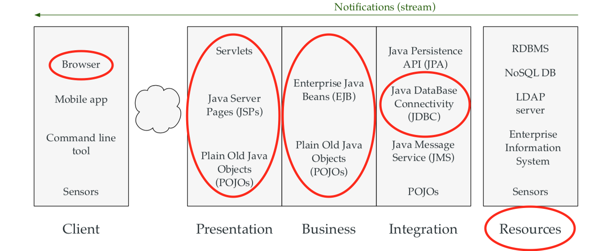

#### Part 1  

> 1. Is Apache Tomcat an application server? The answer to this question depends on the definition of application server. Explain why it is correct to answer positively and negatively to the question.  

__Application Server:__  The runtime environment is provided by an application server: a software that implements the Java EE specification (and more) and where applications can be deployed.  
__Apache Tomcat:__ strictly speaking, not a Java EE application server because it only implements a subset of the Java EE APIs.  

> 2. What is the role of a .war file? Explain how it fits in the Java EE development model and bridges the gap between development and operations.  

__Software engineers__ were responsible for building components and applications.
__IT ops engineers__ were responsible for running these applications.   

A __.war__ file is almost the same thing as a .jar file. It is an archive, which contains compiled classes, resources and metadata. The structure of folders and the name of files is defined in the specification.  

If a new feature has been developed, or when a bug has been fixed in the source code, the enterprise application can be packaged in a .war file. This file can be produced by software engineers and delivered to IT ops engineers.  

> 3. Is the J2EE development model an anti-pattern? On paper, the clear separation between development and operations teams makes sense. However, the current trends in the industry are very different. Explain how modern practices give a different perspective on the question.  

Having silos in the organisation and a clear separation between development and IT operations used to be the norm. This has proven to cause many problems. The trend is to break these barriers and to work in small autonomous teams. This is a core principle in the DevOps approach.  

> 4. What is the difference between the client tier and the presentation tier. They both seem to be related to the user interface, so why are they both needed?  

The __client tier__ consists of the components that are very close to the user (Browser, Mobile app, Command line tool, etc).  

The __presentation tier__ is on the server side. It is responsible for accepting requests and generating views (Servlets, JSPs, POJOs, etc).  

> 5. Consider the web site https://qoqa.ch. It is reasonable to think that it is built on a multi-tiered architecture. Use the 5-layers diagram and draw the components that might be part of the system.  

  

> 6. We have stated that components in the business tier should be decoupled from the user interface. Use the 5-layers diagram and describe a scenario that shows how a business service can be reused across interaction channels.  

The business tier is decoupled from the user interface and is concerned only with business logic. The same business service can serve requests coming from multiple user interaction channels. For instance, in an online shop application, a shopping cart service can be used to serve mobile and desktop users.  

> 7. Most application servers provide 3 ways to deploy a .war file. Describe how these methods work and what are there benefits and drawbacks.  

1. Using Docker  
 * fast
 * there is a way to package and distribute the applications, by creating Docker images  

2. Local installation of the application server  
 * better for the development: this enables some features in the IDE and makes the development cycle more efficient.  

3. ???  
